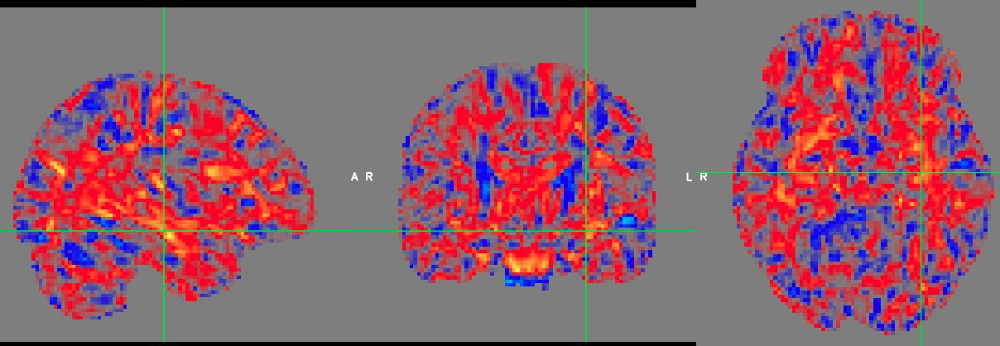

Tracking ADNI via dMRI biomarkers
=================================

The Team of `#neuroheroes`
--------------------------
Julio, Amr, Franz, Marina, Nicolas, Francesco, Matteo, Sebastien, Talia, Rutger

US, Switzerland, Spain, France, Italy

The actual work
---------------
Before the hackaton
* Preprocessing of ADNI-3 dMRI data
* Precomputed the microstructural maps

Here
* **Fetch the data**
* Registration to JHU atlas
* Voxel-wise Effect Size estimation
* JHU-ROI feature extraction

What we're going to have
* Feature tables

We welcome suggestions on
* The ML analysis of the features
    * Pyradigm
    * Neuropredict
* Visualization of data
    * PCA reduced injected into t-SNE
    * PCA reduced injected into U-map

Join us
=======
https://mattermost.brainhack.org/brainhack/channels/adni-dmipy

https://github.com/matteofrigo/ohbm19hackaton_adnidmipy
